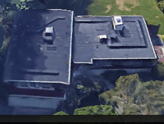
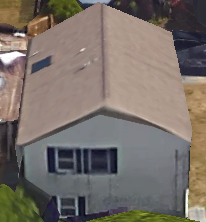
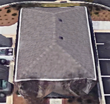
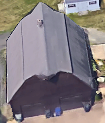
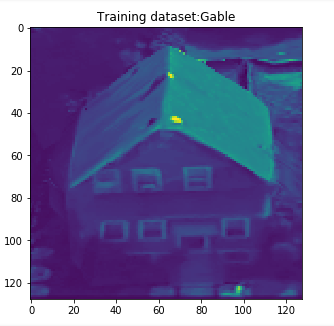
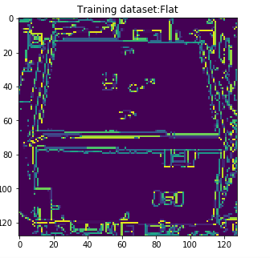
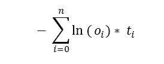
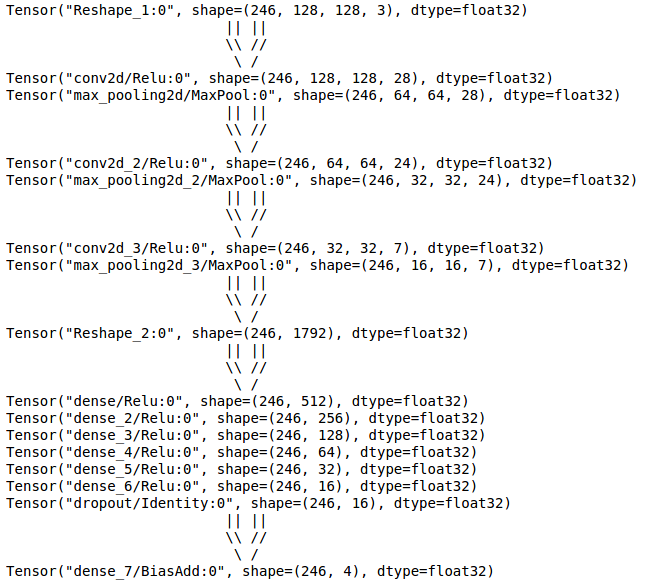

# Roof style classification using Deep learning Network

### Objective:

To classify roof styles using deep learning network

### Problem Type:

Supervised Classification

### Roof Style types:

<table>
<tr><td><b>Roof type-0:</b>Flat</td> <td></td></tr>
<tr><td><b>Roof type-1:</b>Gable</td> <td></td></tr>
<tr><td><b>Roof type-2:</b>Hip</td> <td></td></tr>
<tr><td><b>Roof type-3:</b>Gambrel</td> <td></td></tr></table>

## Steps Involved:

Step - 01: Read Image  
Step - 02: Regular deep net construction for benchmarking  
Step - 03: Convolutional Neural network construction and training  
Step - 04: Accuracy and Analysis  

## Step - 01: Reading Images 

<b>Package Used:</b> Opencv (Please note that opencv shows improved <a href="https://ir.canterbury.ac.nz/bitstream/handle/10092/5430/12630971_2010-Python_for_Prototyping_Computer_Vision_Applications.pdf?sequence=1&isAllowed=y">gaussian filter performance</a> over scipy)

In case of regular neural network, to perform dot product of input values and weights:  
<font=8><b>Pred_Y = X.W + b </b>   
Since this is matrix multiplication (X.W), it should be in the "mxn" and "nxj" format to get "mxj" form.  
To enable this multiplication, the image must be flattened to 1 dimension.
In our case, all our images are first reshaped to 128x128x3.
Using opencv, all the images are converted to Grayscale thereby reducing third dimension to 128x128x1   

<b>Converted Gray Scale Image:</b>   

This converted image is further reduced to get a one dimensional matrix of 16384 and fed to a regular deep network.
 
Another deep net with edges detected was ran to benchmark performance against regular deep net.

<font=15><b>Note:</b>   In case of convolutional neural network, images of dimension (128x128x3) are directly fed to the model and tested

## Step - 02: Regular Deep net for benchmarking

<b>Package Used:</b> Tensorflow
 
<b>Layers:</b>
<table> <tr><td>Layers</td><td>Dimensions</td></tr> 
<tr><td>Input_layer</td><td>16384</td>
<tr><td>Output_layer</td><td>4</td> </table>
  
<b>Computation:</b>   SoftMax(<font=8>Pred_Y = X.W + b )   
<b>Cross Entropy:</b>    
<b>Optimizer:</b> Gradient Descent to minimize cross entropy

## Step - 03: Convolutional neural network construction and working

<b>Package Used:</b> Tensorflow with CUDA  - Bitfusion Amazon Cloud (AWS)   
<b>Layers:</b>    
<b>Optimizer:</b> Stochastic Gradient Descent (SGD) with learning rate = 0.001   

## Step - 04: Accuracy and Analysis

<table width =900><tr><td><b>Network type</b></td><td><b>Accuracy</b></td><td><b>Inference</b></td></tr>
<tr><td>Regular Net</td><td>34.92%</td><td>Performance with 1D array is low because we destroy all the features (color and 2D)</td></tr>
<tr><td>Regular Net - After Edge detection</td><td>34.92%</td><td>Performance is same as Regular Net. Feature selection has zero impact on the performance of net</td></tr>
<tr><td>Convolutional Neural Net</td><td>69.84%</td><td>Performance increased tremendously. Increasing number of records in training and test set will increase accuracy.</td></tr>
</table>
